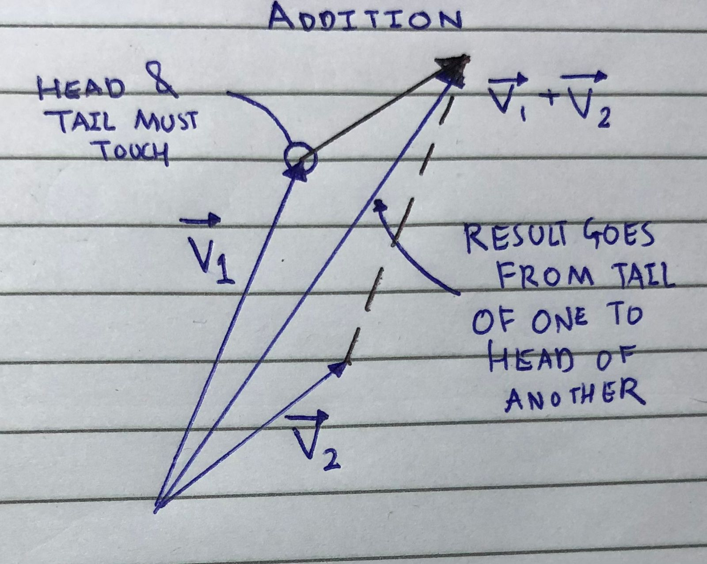
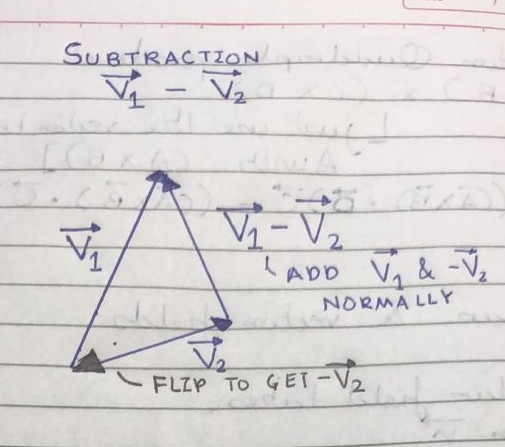
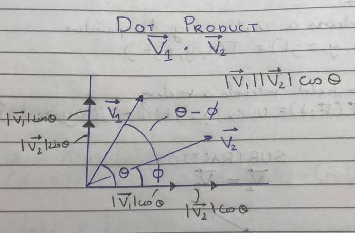
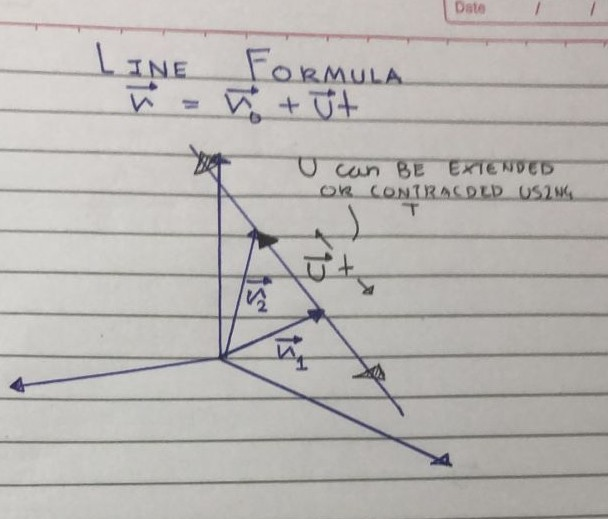

## Vectors and analytic geometry

**Course: HKUST Vector calculus for engineers**

**Module: 1**

**Date completed: 16/05/26**

*Caution: These notes are meant to be for revision after learning the subject , not as a method for teaching oneself the subject*

## Introduction

#### What are vectors ?

Well the concept of vectors are very simple to grasp, they're simply representations of something that have both a direction and magnitude, like a force for example, they're extremely useful in physics, maths etc in order to model the world. 

#### What is its magnitude ?

Given a vector $1 \hat i +2 \hat j$ the magnitude is simply $\sqrt{1^2 +2^2}$ this apply to **All dimensionality** vectors, simply take the square root of the squares  of all elements of the vector of n dimensions.

#### What is its direction?

Simply take the vector and divide it through by the magnitude, this will give a vector of unit magnitude and desired direction: $\frac{1}{\vert v\vert} \hat i + \frac{2}{\vert v\vert} \hat j$

## 

## Operations on vectors:

#### Addition

$v_1=2\hat i+3 \hat j +4 \hat k$

$v_2=-1 \hat i+-4  \hat j +4 \hat k$

$v_1 + v_2 = v_{result}=(2-1) \hat i+ (3-4) \hat j +(4+4) \hat k$

$v_{result}=1 \hat i+ -1 \hat j +8 \hat k$

#### Scalar Multiplication

$2*v_1= (2*2)\hat i+(2*3) \hat j +(4*4) \hat k$

$2*v_1= 4 \hat i+6 \hat j +16 \hat k$

#### Subtraction

$v_1=2\hat i+3 \hat j +4 \hat k$

$v_2=-1 \hat i+-4 \hat j +4 \hat k$

$v_1 - v_2= v_{result}=(2+1) \hat i+ (3+4) \hat j +(4-4) \hat k$

$v_{result}=3 \hat i+ 7 \hat j +0 \hat k$

$v_{result}=3 \hat i+ 7 \hat j$

###### 

###### Properties of vector addition, subtraction and scalar multiplication

+ **Commutativity :** $\vec{A}+\vec{B}=\vec{B}+\vec{A}$

+ **Associativity :** $\vec{A}+(\vec{B}+\vec{C})=(\vec{A}+\vec{B})+\vec{C}$

+ **Distributivity of scalar multiplication :** $k(\vec{A}+\vec{B})=k\vec{B}+k\vec{A}$

#### Dot product

It gives a **Scalar result** it basically consists of multiplying the elements of two vectors  in order, first element into first, second into second and summing up the resulting values. The dot product has a physical meaning which we shall derive soon.

$v_1=2\hat i+3 \hat j +4 \hat k$

$v_2=-1 \hat i+-4 \hat j +4 \hat k$

$v_1 \cdot v_2= v_{result}=(2 \times -1) \hat i+ (3 \times -4) \hat j +(4 \times 4) \hat k$

$v_{result}=-2 \hat i+ -12 \hat j +16 \hat k$

###### Interpretation

The dot product has a physical interpretation **IN ALL DIMESNIONS** in **general** it can be thought to measure the similarity between between two vectors, it very often used in vector DBs, clustering analysis etc *DWM flashbacks*. In two dimensions it can actually be thought to be the the area of the parallelogram formed by the two vectors that are multiplied together. 

$\vec{V_1}$ vector has a magnitude $|\vec{V_1}|$

it can be expressed as:

$|\vec{V_1}| \cos \theta \, \hat{i} + |\vec{V_1}| \sin \theta \, \hat{j}$

Similarly for $\vec{V_2}$ we have:

$|\vec{V_2}| \cos \phi \, \hat{i} + |\vec{V_2}| \sin \phi \, \hat{j}$

$\vec{V_1} \cdot \vec{V_2}$

$= |\vec{V_1}| |\vec{V_2}| \cos \theta \cos \phi + |\vec{V_1}| |\vec{V_2}| \sin \theta \sin \phi$

$= |\vec{V_1}| |\vec{V_2}| (\cos \theta \cos \phi + \sin \theta \sin \phi)$

Now we know:

$\cos(A - B) = \cos A \cos B + \sin A \sin B$

$\therefore = |\vec{V_1}| |\vec{V_2}| \cos(\theta - \phi)$

$\theta - \phi =$ angle between the lines

so dot product gives:

$= |\vec{V_1}| |\vec{V_2}| \cos(\Delta)$

Since $\cos(x) = 1 $ when the angle $x$ is 0 and equals to $0$ when the angle $x$ is $\frac{\pi}{2} \ radians \ or \ 90^{o} \ degrees$  this means that the dot product is **0 when the vectors are perpendicular and the multiple of the magnitudes when the vectors are parallel** 

$i \cdot i = j \cdot j = k \cdot k =1$

$i \cdot j = j \cdot k = k \cdot i =0$

###### Properties of dot product

+ **Commutativity :** $\vec{A} \cdot \vec{B}=\vec{B} \cdot \vec{A}$

+ **Associativity :**$ \vec{A} \cdot (\vec{B} \cdot \vec{C})=(\vec{A} \cdot \vec{B}) \cdot \vec{C}$

+ **Distributivity of dot product :** $\vec{k}\cdot(\vec{A} + \vec{B})=\vec{k}\cdot\vec{B} +  \vec{k}\cdot\vec{A} $

###### Proof

**Distributivity of Dot Product**

Let $v_1=(a_1,a_2,a_3),\; v_2=(b_1,b_2,b_3),\; v_3=(c_1,c_2,c_3)$

Then $v_2+v_3=(b_1+c_1,\; b_2+c_2,\; b_3+c_3)$

So,
$v_1 \cdot (v_2+v_3)=a_1(b_1+c_1)+a_2(b_2+c_2)+a_3(b_3+c_3)$

$= (a_1b_1+a_2b_2+a_3b_3)+(a_1c_1+a_2c_2+a_3c_3)$

$= v_1 \cdot v_2 + v_1 \cdot v_3$

#### 

#### Cross product

The cross product is a more complicated product, it is taken by arranging the two vectors into a determinant and putting the $\hat i, \hat j, \hat k$ values in the top row, the $a_1, a_2, a_3$ values in the middle and the $b_1, b_2, b_3$  values in the bottom

$v_1 = 2\hat i + 3\hat j + 4\hat k$

$v_2 = -1\hat i - 4\hat j + 4\hat k$

$v_1 \times v_2 =
\begin{vmatrix}
\hat i & \hat j & \hat k \\
2 & 3 & 4 \\
-1 & -4 & 4
\end{vmatrix}$

$= \hat i \begin{vmatrix} 3 & 4 \\ -4 & 4 \end{vmatrix} \hat j \begin{vmatrix} 2 & 4 \\ -1 & 4 \end{vmatrix} \hat k \begin{vmatrix} 2 & 3 \\ -1 & -4 \end{vmatrix}$

$\hat i (3\cdot4 - 4\cdot(-4))\hat j (2\cdot4 - 4\cdot(-1))\hat k (2\cdot(-4) - 3\cdot(-1))$

$\hat i (12 + 16) \hat j (8 + 4) \hat k (-8 + 3)$

$= 28\hat i - 12\hat j - 5\hat k$

###### Interpretation

The cross product unlike the dot product is **Only interpretable and applies to vectors with three dimensions** , and is the vector **whose direction is perpendicular to the plane formed by the two input vectors** and whose magnitude is **Equal to the parallelogram formed by the two inputs.** 

**For the physical interpretation of the cross product, we assume that $V_1$ lies on an axis & $V_2$ is 2 dimensional.**

$\vec{V_1} = |\vec{V_1}| \hat{i}$

$\vec{V_2} = |\vec{V_2}| \cos \theta \hat{i} + |\vec{V_2}| \sin \theta \hat{j}$

Then the cross product is:

$\begin{vmatrix}
\hat{i} & \hat{j} & \hat{k} \\
|\vec{V_1}| & 0 & 0 \\
|\vec{V_2}| \cos \theta & |\vec{V_2}| \sin \theta & 0
\end{vmatrix}$

$\Rightarrow (0 - 0) \hat{i} - (0-0)\hat{j} + (|\vec{V_1}| |\vec{V_2}| \sin \theta - 0) \hat{k}$

$\Rightarrow - |\vec{V_1}| |\vec{V_2}| \sin \theta \hat{k}$

$\Rightarrow$ **take magnitude**

$\Rightarrow |\vec{V_1}| |\vec{V_2}| \sin \theta$

**Therefore the greater the angle of separation, the greater the magnitude for the cross product, this fits in with the physical interpretation since as $\theta$ increases area of parallelogram increases & so does the magnitude of cross product.**

Now since $sin(x) = 1$ when $x$ is $90^o$ and it is equal to $0$ when x is $0$ we get the opposite of dot product, if the inputs are perpendicular then the results magnitude is the product of the magnitudes but if it is parallel it is $0$ however the cross product unlike the dot product **is a vector product so it has both direction and magnitude **

$i \times i = j \times j = k \times k =0 $

But 

$i \times j = k \quad j \times k = i \quad i \times k =j$

&

$j \times i = -k \quad k \times j = -i \quad k \times i =-j $

notice that the non-present unit vector is always produced, and if the conventional order is not maintained than the result is negative.

**Why ?**

**We know that $cross \ product= determinant \quad AND \quad that \ if \ we \ change \ the \ of \ the \ determinant \ we \ get \ its \ negative $**

so getting $i \times j = k$ if we switch the places then the the rows of the determinant will be swapped leading to a negative version of the answer so we get $j \times i = -k$

###### Properties of the cross product (derived from determinants)

+ **Commutativity :** $\vec{A} \times \vec{B}=- \vec{B} \times \vec{A}$

+ **Distributivity over vector addition:** $\vec{A} \times (\vec{B} + \vec{C})=\vec{A} \times \vec{B} + \vec{A} \times \vec{C}$

+ **Distributivity of scalar multiplication over cross :** $\vec{k}(\vec{A} \times \vec{B})=\vec{k}\vec{B} \times  \vec{A}=\vec{B} \times \vec{k}\vec{A}$

## Analytic Geometry

#### Of lines

The formula for a line can be derived from two points which lie on the line, represented by a position vectors $\vec{r_1}, \vec{r_2}$ we find a vector that lines on the line by taking the difference of the two $\vec{u}= \vec{r_1}- \vec{r_2}$ , .Ans the using any $r$ as $r_0$ we obtain the formula for the line. 

$\vec{r}=\vec{r_0}+\vec{u}t$

we can think of $u$ being like a slider and $t$ telling us how much to slide that slider along the direction of the line. An illustration will make it more clearer. 

###### Example

Points (5,-3,8), (-7,8,-9), find out the equation of the line and the point where the line intersects the $z=0$ or $x-y$ plane.

$\vec{u}=\vec{r_1}-\vec{r_2}$

$\vec{u}=(5+7)\hat i +(-2-8)\hat j +(8+9)\hat k$

$\vec{u}= 12 \hat i +-10 \hat j +17 \hat k$

$\vec{r}= 5 \hat i +-3 \hat j +8 \hat k \quad + \quad t(12 \hat i +-10 \hat j +17 \hat k)$

$\vec{r}=(5+12t)\hat i +(-3-10t)\hat j +(8+17t)\hat k$

now putting $z=0$ we get

$t=\frac{-8}{17}$

$(\frac{-11}{17}, 1\frac{12}{17}, 0)$

#### Of planes

Okay for planes its a bit more complicated, we need three points on that plane such that they are not collinear, we need $\vec{r_1}, \vec{r_2}, \vec{r_3}$  now from the differences we get two lines that lie on the plane itself $\vec{u_1}, \vec{u_2}$ and then we take the cross product to get the thing we really want, the line $\vec{N}$ which is exactly perpendicular to the plane, form tehre we get the formula. 

$\vec{N} \cdot(\vec{r}-\vec{r_0})=0$ 

which simplifies to 

$ax+by+cd=0$

Basically a point on the plane's difference with another point will produce a line that lies on the plane, and the lines dot product with $\vec{N}$ will always be 0 since they are perpendicular and $cos(90)=0$ 

###### Example

We have three points on a plane (-1,8,7), (4,-7,6) & (0,0,12) find the formula and the line that intersects with the z=0 plane

Points $A(-1,8,7),\; B(4,-7,6),\; C(0,0,12)$

$\vec{AB}=\vec{r_B}-\vec{r_A}=(4+1)\hat i+(-7-8)\hat j+(6-7)\hat k$

$\vec{AB}=5\hat i-15\hat j-1\hat k$

$\vec{AC}=\vec{r_C}-\vec{r_A}=(0+1)\hat i+(0-8)\hat j+(12-7)\hat k$

$\vec{AC}=1\hat i-8\hat j+5\hat k$

Now the normal vector:

$\vec{n}=\vec{AB}\times\vec{AC}$

$\vec{n}=
\begin{vmatrix}
\hat i & \hat j & \hat k \\
5 & -15 & -1 \\
1 & -8 & 5
\end{vmatrix}$

$= \hat i((-15)(5)-(-1)(-8))\hat j((5)(5)-(-1)(1))\hat k((5)(-8)-(-15)(1))$

$= \hat i(-75-8)\hat j(25+1)\hat k(-40+15)$

$= -83\hat i-26\hat j-25\hat k$

Equation of plane:

$-83(x+1)-26(y-8)-25(z-7)=0$

$-83x-83-26y+208-25z+175=0$

$-83x-26y-25z+300=0$

Now intersect with $z=0$:

$-83x-26y+300=0$

$83x+26y=300$

Line of intersection in parametric form:

Let $x=t$

$y=\frac{300-83t}{26}$

$z=0$

So,

$\vec{r}=t\hat i+\frac{300-83t}{26}\hat j+0\hat k$

## Vector Identities

To prove these identities we will require the Levi civita and the Kronecker delta identities, they go from 1 to 3 in their indices and are defined as-

**Kronecker Delta**

$$
\delta_{ij} =
\begin{cases}
1 & \text{if } i = j \\
0 & \text{if } i \ne j
\end{cases}
$$

$i, j$ can be from 1,2,3 so there are 9 different inputs the delta can take

**Levi Civita symbol**

$$
\epsilon_{ijk} =
\begin{cases}
1 & \text{if } (i,j,k) \text{ is a cyclic permutation of } (1,2,3) \\
-1 & \text{if } (i,j,k) \text{ is an anti-cyclic permutation} \\
0 & \text{otherwise}
\end{cases}
$$

There are 27 different inputs for the levi-civita symbol

**Einstein notation**

instead of writing $\sum_{i=1}^3\sum_{j=1}^3\delta_{ij}$ we can write $\delta_{ij}$ similarly if we want $i=j$ then we can write $\delta_{ii}$ or for dot product we can write $A_{i}B_{i}$ where i is the index.

Using notation we get 

$\delta_{ij} = 3$ 

$\delta_{ii} = 3$

$\epsilon_{ijk}=0$

$\epsilon_{ijk}\epsilon_{ijk}=6$

etc

#### Proofs

*Caution, these proofs are purposefully terse, written in my style, do not use these to understand the proofs first, only to revise*

---

$\epsilon_{ijk} = \epsilon_{kij} = \epsilon_{jki}$

in the case of two elements being equal we get $0$ for all

in the case of an arrangement $1, 2, 3$ in order, the order is maintained for all so $1$

in the case of disorder all are $-1$

**hence proved**

---

$\delta_{ij} A_j = A_i$

if $j \neq i$ then the whole thing is $0$

if $j = i$ then $\delta_{ij} A_j = A_i$

**QED**

---

$\delta_{ik} \delta_{kj} = \delta_{ij}$

if $i \neq j$ then one will be zero and we get $0$

only if $i = j$ do we get $1$ when $i = k = j$

**QED**

---

## 1. The Levi-Civita - Kronecker Delta Identity

We will accept that:

$\epsilon_{ijk} \epsilon_{lmn} = \delta_{il}(\delta_{jm}\delta_{kn} - \delta_{jn}\delta_{km}) - \delta_{im}(\delta_{jl}\delta_{kn} - \delta_{jn}\delta_{kl}) + \delta_{in}(\delta_{jl}\delta_{km} - \delta_{jm}\delta_{kl})$[^1]

Now, when indices match ($i=l$):

$\epsilon_{ijk} \epsilon_{imn} = \delta_{jm}\delta_{kn} - \delta_{jn}\delta_{km}$

*(All other terms will be 0)*

### Cross Product Component Proof

Finally we prove that $[\vec{A} \times \vec{B}]_i \text{ (the } i^{th} \text{ term)} = \epsilon_{ijk} A_j B_k$

**Example for the 2nd component ($\hat{j}$):**

$[\vec{A} \times \vec{B}]_2 = \epsilon_{2jk} A_j B_k$

*(Since $j, k$ must be $1, 3$ or $3, 1$, otherwise it will be 0)*

$= \epsilon_{213} A_1 B_3 + \epsilon_{231} A_3 B_1$

$= -A_1 B_3 + A_3 B_1$

$-(A_1 B_3 - A_3 B_1) \hat{j} \iff -A_1 B_3 + A_3 B_1$

---

## 2. Proving the Triple Products

Now we are ready to prove the identities.

### Scalar Triple Product

This actually has an interpretable physical meaning, it is the volume of a parallelopiped:

$\vec{A} \cdot (\vec{B} \times \vec{C}) = \vec{C} \cdot (\vec{A} \times \vec{B}) = \vec{B} \cdot (\vec{C} \times \vec{A})$

**Proof:**

Take first decompose $= \vec{A} \cdot (\vec{B} \times \vec{C})$

$= A_i (B \times C)_i$

$= A_i \epsilon_{ijk} B_j C_k$

$= C_k \epsilon_{ijk} A_i B_j \text{ (commutative)}$

$= C_k \epsilon_{kij} A_i B_j \text{ (since } \epsilon_{ijk} = \epsilon_{kij} \text{)}$

$= C_i [\vec{A} \times \vec{B}]_i$

$= \vec{C} \cdot (\vec{A} \times \vec{B})$

### Vector Triple Product (BAC-CAB Identity)

$\vec{A} \times (\vec{B} \times \vec{C}) = (\vec{A} \cdot \vec{C})\vec{B} - (\vec{A} \cdot \vec{B})\vec{C}$

**Proof:**

Take $= [\vec{A} \times (\vec{B} \times \vec{C})]_i$

$= \epsilon_{ijk} A_j [\vec{B} \times \vec{C}]_k$

$= \epsilon_{ijk} A_j \epsilon_{kmn} B_m C_n$

$= \epsilon_{ijk} \epsilon_{kmn} A_j B_m C_n \text{ (associative)}$

$= \epsilon_{kij} \epsilon_{kmn} A_j B_m C_n \text{ (swapping indices)}$

$= (\delta_{im}\delta_{jn} - \delta_{in}\delta_{jm}) A_j B_m C_n \text{ (using the identity above)}$

$= A_n C_n B_i - A_j B_j C_i \text{ (since } \delta_{ij}A_j = A_i \text{)}$

$= [(\vec{A} \cdot \vec{C})\vec{B} - (\vec{A} \cdot \vec{B})\vec{C}]_i$

---

## 3. Quadruple Products

### Scalar Quadruple Product

$(\vec{A} \times \vec{B}) \cdot (\vec{C} \times \vec{D}) = (\vec{A} \cdot \vec{C})(\vec{B} \cdot \vec{D}) - (\vec{A} \cdot \vec{D})(\vec{B} \cdot \vec{C})$

**Proof:**

Take $= [\vec{A} \times \vec{B}]_i [\vec{C} \times \vec{D}]_i$

$= \epsilon_{ijk} A_j B_k \epsilon_{imn} C_m D_n$

$= \epsilon_{ijk} \epsilon_{imn} A_j B_k C_m D_n$

$= (\delta_{jm}\delta_{kn} - \delta_{jn}\delta_{km}) A_j B_k C_m D_n$

$= A_m C_m B_n D_n - A_n D_n B_m C_m$

$= (\vec{A} \cdot \vec{C})(\vec{B} \cdot \vec{D}) - (\vec{A} \cdot \vec{D})(\vec{B} \cdot \vec{C})$

### Vector Quadruple Product

$(\vec{A} \times \vec{B}) \times (\vec{C} \times \vec{D})$

*[Just use the vector triple product, replacing $\vec{A}$ with $(\vec{A} \times \vec{B})$*

$= ((\vec{A} \times \vec{B}) \cdot \vec{D})\vec{C} - ((\vec{A} \times \vec{B}) \cdot \vec{C})\vec{D}$

---

## 4. Scalar and Vector Fields

**A scalar field** takes:

+ Position $\vec{r}$

+ Time $t$
  
  And returns a **scalar**, e.g., temperature:
  
  $T(x, y, z; t)$

**A vector field** returns a **vector**:

$\vec{U}(\vec{r}, t) = U_1(x, y, z; t)\hat{i} + U_2(x, y, z; t)\hat{j} + U_3(x, y, z; t)\hat{k}$

---

[^1]: this can be actually proved using the fact that the levi civita symbol behaves like a determinant and the Kronecker delta behaves like the dot product between the rows of two identity matrices. 
