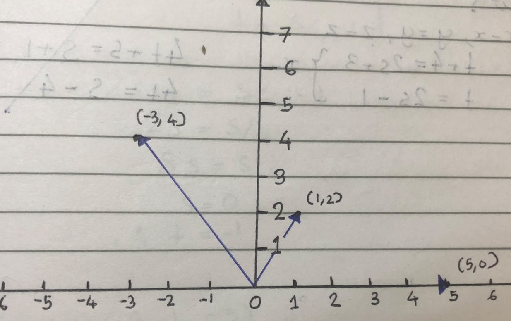
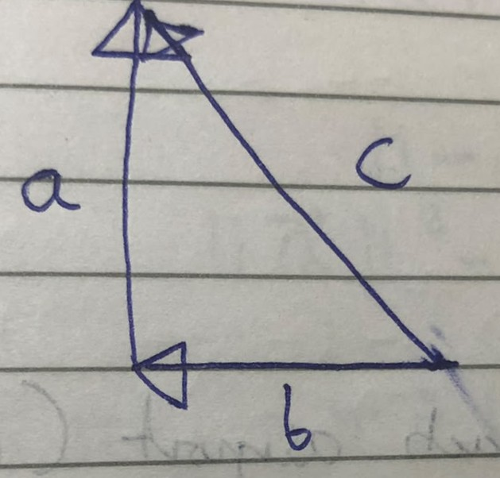
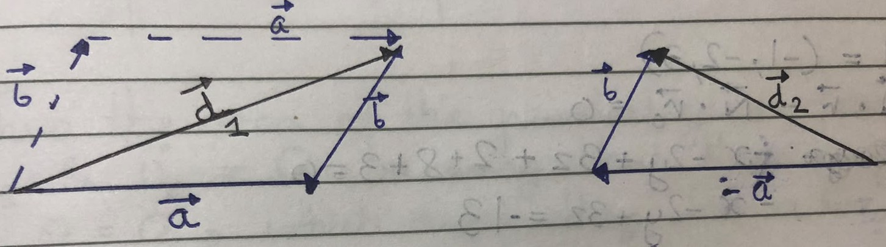
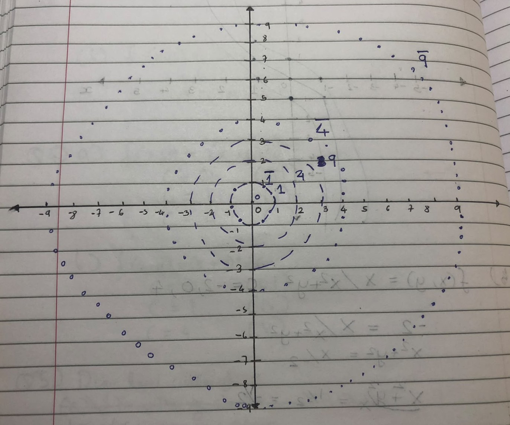
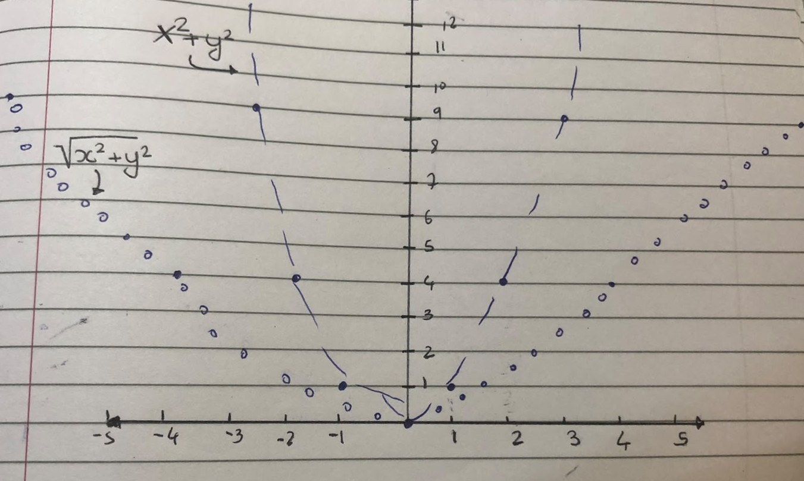

## Problems for module 1

**Textbook: Vector Calculus by Marsden and Tromba**

**Module: 1**

**Date completed: 30/05/26**

*These are not all the problems that I have attempted, but only a specially curated set of problems which I believe serve to demonstrate the understanding and application of the concepts learnt , along with my answers*

#### Section 1.1 (Textbook)

**Q20.** Show that $l_1(t) = (1, 2, 3) + t(1, 0, -2)$ and $l_2(t) = (2, 2, 1) + t(-2, 0, 4)$ parametrize the same line.

**Solution:**

If we can find two points common to both lines, they are the same line.

1. Take $t = 0$ for $l_1$: $l_1(0) = (1, 2, 3)$.

2. Take $t = \frac{1}{2}$ for $l_2$: $l_2(\frac{1}{2}) = (2, 2, 1) + \frac{1}{2}(-2, 0, 4) = (2, 2, 1) + (-1, 0, 2) = (1, 2, 3)$.

3. Take $t = 1$ for $l_1$: $l_1(1) = (1 + 1, 2, 3 - 2) = (2, 2, 1)$.

4. Take $t = 0$ for $l_2$: $l_2(0) = (2, 2, 1) + 0(-2, 0, 4) = (2, 2, 1)$.

Since they share two points, they parametrize the same line.

**Q21.** Do the points $(2, 3, -4)$, $(2, 1, -1)$, and $(2, 7, -10)$ lie on the same line?

**Solution:**

We will form a line from any two points and check whether the 3rd falls on the line or not.

Direction vector: $\vec{u} = (2, 3, -4) - (2, 1, -1) = (0, 2, -3)$.

Line: $l = (2, 3, -4) + t(0, 2, -3)$.

Taking $t = 2$:

$l = (2, 3, -4) + (0, 4, -6) = (2, 7, -10)$.

The third point is on the line formed by the others. Thus all fall on the same line.

**Q22.** $\vec{u} = (1, 2)$, $\vec{v} = (-3, 4)$, $\vec{w} = (5, 0)$.

Find scalars such that $\vec{w} = \lambda_1 \vec{u} + \lambda_2 \vec{v}$.

**Solution:**

Take $\lambda_1 = 2, \lambda_2 = -1$:

$(5, 0) = 2(1, 2) + -1(-3, 4) = (2, 4) + (3, -4) = (5, 0)$.

**Q27.** Do $x = 3t + 2, y = t - 1, z = 6t + 1$ and $x = 3s - 1, y = s - 2, z = s$ intersect?

**Solution:**

Intersection means they share a point: $x = x, y = y, z = z$.

1. $3t + 2 = 3s - 1 \Rightarrow 3t = 3s - 3 \Rightarrow t = s - 1$.

2. $t - 1 = s - 2 \Rightarrow t = s - 1$.

3. $6t + 1 = s \Rightarrow 6t=s-1 \Rightarrow t=\frac{5}{6}-\frac{1}{6}$.
   
   $6s-1 = \frac{5}{6}-\frac{1}{6}$
   
   $5s=5$
   
   $s=1$
   
   Then $t = 0$.
   
   Intersection point: $(2, -1, 1)$.
   
   

**Q28.** Do $l_1 = (t + 4, 4t + 5, t - 2)$ and $l_2 = (2s + 3, s + 1, 2s - 3)$ intersect?

**Solution:**

Equate coordinates:

1. $t + 4 = 2s + 3 \Rightarrow t = 2s - 1$.

2. $4t + 5 = s + 1 \Rightarrow 4t = s - 4 \Rightarrow t = \frac{s}{4} - 1$.
   
   Equating $t$: $2s - 1 = \frac{s}{4} - 1 \Rightarrow 2s = \frac{s}{4} \Rightarrow 8s = s \Rightarrow s = 0$.
   
   Then $t = -1$.
   
   Check $z$: $t - 2 = -1 - 2 = -3$. For $l_2$: $2s - 3 = 0 - 3 = -3$.
   
   Intersection point: $(3, 1, -3)$.
   
   

**Q37.** Find a line that lies entirely in the set defined by the equation $x^2 + y^2 - z^2 = 1$.

**Solution:**

This can be accomplished easily by taking $x = 1$ always and $y = z$ always, thus the identity will always yield 1: $1^2 + z^2 - z^2 = 1$.

Line: $l(t) = (1, 0, 0) + t(0, 1, 1)$.

#### Section 1.2

**Q12.** Let $v = (2, 3)$. Suppose $w$ is perpendicular to $v$ and that $\|w\| = 5$. Find one such $w$.

**Solution:**

$w = a\hat{i} + b\hat{j}$.

$w \cdot v = 0 \Rightarrow 2a + 3b = 0 \Rightarrow a = -\frac{3b}{2}$.

$\|w\| = 5 \Rightarrow a^2 + b^2 = 25$.

$\frac{9b^2}{4} + b^2 = 25 \Rightarrow \frac{13b^2}{4} = 25 \Rightarrow b^2 = \frac{100}{13} \Rightarrow b = \frac{10}{\sqrt{13}}$.

$a = -\frac{3(10/\sqrt{13})}{2} = -\frac{15}{\sqrt{13}}$.

$w = -\frac{15}{\sqrt{13}}\hat{i} + \frac{10}{\sqrt{13}}\hat{j}$.

**Q13.** Find $b, c$ so that $(5, b, c)$ is orthogonal to both $(1, 2, 3)$ and $(1, -2, 1)$.

**Solution:**

1. $5(1) + 2b + 3c = 0 \Rightarrow 2b + 3c = -5$.

2. $5(1) - 2b + c = 0 \Rightarrow -2b + c = -5 \Rightarrow c = 2b - 5$.
   
   Substituting: $2b + 3(2b - 5) = -5 \Rightarrow 8b = 10 \Rightarrow b = \frac{5}{4}$.
   
   $c = 2(\frac{5}{4}) - 5 = \frac{5}{2} - 5 = -\frac{5}{2}$.
   
   

**Q15.** What is the geometric relationship between $v$ and $w$ if $v \cdot w = -\|v\| \|w\|$?

**Solution:**

This means $\cos \theta = -1$, meaning the two vectors are exactly $180^\circ$ to each other.

**Q17.** Find all values of $x$ such that $(7, x, -10)$ and $(3, x, x)$ are orthogonal.

**Solution:**

$21 + x^2 - 10x = 0$.

$x^2 - 10x + 21 = 0 \Rightarrow (x - 7)(x - 3) = 0$.

$x = 7, x = 3$.

**Q23.** Vectors $v, w$ are sides of an equilateral triangle with side length 1. 

**Solution:**

$v \cdot w = \|v\| \|w\| \cos 60^\circ = 1 \cdot 1 \cdot \frac{1}{2} = \frac{1}{2}$.

**Q26.** Find the line through $(3, 1, -2)$ that intersects and is perpendicular to $l: x = -1 + t, y = -2 + t, z = -1 + t$.

**Solution:**

The intersection point is $(x_0, y_0, z_0) = (-1 + t, -2 + t, -1 + t)$.

Direction vector from line to point: $\vec{d} = (3 - x_0, 1 - y_0, -2 - z_0)$.

$\vec{d} = (3 - (-1+t), 1 - (-2+t), -2 - (-1+t)) = (4-t, 3-t, -1-t)$.

Perpendicular: $\vec{d} \cdot (1, 1, 1) = 0$.

$(4 - t) + (3 - t) + (-1 - t) = 0 \Rightarrow 6 - 3t = 0 \Rightarrow t = 2$.

Intersection point: $(1, 0, 1)$.

Direction vector: $(1-3, 0-1, 1-(-2)) = (-2, -1, 3)$.

Line: $l = (3, 1, -2) + t(-2, -1, 3)$.

**Q27.** Using the dot product, prove the converse of the Pythagorean theorem: i.e., if $a^2 + b^2 = c^2$ then triangle is right angled.

**Solution:**

We know $\vec{a} + \vec{b} = \vec{c}$.

$\|\vec{c}\|^2 = \|\vec{a} + \vec{b}\|^2 = (\vec{a} + \vec{b}) \cdot (\vec{a} + \vec{b}) = \|\vec{a}\|^2 + 2\vec{a} \cdot \vec{b} + \|\vec{b}\|^2$.

Given $\|\vec{a}\|^2 + \|\vec{b}\|^2 = \|\vec{c}\|^2$.

It can only equal if $2\vec{a} \cdot \vec{b} = 0$, so $\vec{a} \cdot \vec{b} = 0$.

The triangle is right angled only when $\theta = 90^\circ$.

**Q30.** An airplane is located at position $(3, 4, 5)$ at noon and is traveling at $(400, 500, -1)$ km/h. The pilot spots an airport at $(23, 29, 0)$.

(a) At what time will plane pass over the airport?

(b) How high above the airport will the plane be?

**Solution:**

(a) Distance to cover in $x$ direction: $23 - 3 = 20$ km.

Velocity in $x$: 400 km/h.

Time $t = 20/400 = 1/20$ hours = 3 minutes.

Check $y$: $4 + 500(1/20) = 4 + 25 = 29$ km (Matched).

(b) Altitude $z = 5 + (-1)(1/20) = 5 - 0.05 = 4.95$ km.

**Q38.** Show that in any parallelogram the sum of the squares of the lengths of four sides equals the sum of the squares of lengths of diagonals.

**Solution:**

Let sides be $\vec{a}$ and $\vec{b}$.

Diagonals: $\vec{d}_1 = \vec{a} + \vec{b}$ and $\vec{d}_2 = -\vec{a} + \vec{b}$.

$\|\vec{d}_1\|^2 = \|\vec{a}\|^2 + \|\vec{b}\|^2 + 2\vec{a} \cdot \vec{b}$.

$\|\vec{d}_2\|^2 = \|\vec{a}\|^2 + \|\vec{b}\|^2 - 2\vec{a} \cdot \vec{b}$.

Sum of squares of diagonals: $\|\vec{d}_1\|^2 + \|\vec{d}_2\|^2 = 2\|\vec{a}\|^2 + 2\|\vec{b}\|^2$.

This equals the sum of the squares of the four sides ($a, b, a, b$). QED.

#### Section 1.3

**Q15.** Find an equation for a plane that:

(a) is perpendicular to $v = (1, 1, 1)$ and passes through $(1, 0, 0)$.

(d) is perpendicular to $l(t) = (0, 3, 1) + t(-1, -2, 3)$ and passes through $(2, 4, -1)$.

**Solution:**

(a) $\vec{N} \cdot (\vec{r} - \vec{r}_0) = 0 \Rightarrow (1, 1, 1) \cdot (x-1, y, z) = 0 \Rightarrow x + y + z = 1$.

(d) $\vec{N} = (-1, -2, 3)$.

$-1(x-2) - 2(y-4) + 3(z+1) = 0 \Rightarrow -x + 2 - 2y + 8 + 3z + 3 = 0 \Rightarrow x + 2y - 3z = 13$.

**Q16.** Find an equation for the plane that passes through $(0, 0, 0), (2, 0, -1)$ and $(0, 4, -3)$.

**Solution:**

$\vec{u}_1 = (2, 0, -1)$, $\vec{u}_2 = (0, 4, -3)$.

$\vec{N} = \vec{u}_1 \times \vec{u}_2 = \begin{vmatrix} \hat{i} & \hat{j} & \hat{k} \\ 2 & 0 & -1 \\ 0 & 4 & -3 \end{vmatrix} = 4\hat{i} + 6\hat{j} + 8\hat{k}$.

Equation: $4x + 6y + 8z = 0$.

**Q17.** Show that $(0, -2, -1), (1, 4, 0), (2, 10, 1)$ do not determine a unique plane.

**Solution:**

$\vec{u}_1 = (0, -2, -1) - (2, 10, 1) = (-2, -12, -2)$.

$\vec{u}_2 = (0, -2, -1) - (1, 4, 0) = (-1, -6, -1)$.

$\vec{N} = \begin{vmatrix} \hat{i} & \hat{j} & \hat{k} \\ -2 & -12 & -2 \\ -1 & -6 & -1 \end{vmatrix} = 0$.

The vectors are parallel; they form a line, not a plane.

**Q18.** Let $P$ be the plane $x + y + z = 1$. Which points are contained?
(a) $(0, 0, 0): 0 \ne 1$. No.
(b) $(1, 1, -1): 1+1-1=1$. Yes.
(c) $(-3, 8, -4): -3+8-4=1$. Yes.
(d) $(1, 2, -3): 1+2-3=0 \ne 1$. No.

**Q22.** Find the intersection of the two planes $3x + 2y + z = 2$ and $x + 4y - z = 2$.

**Solution:**

Add equations: $4x + 6y = 4 \Rightarrow 2x + 3y = 2$.

Set $z = t$:

$y = \frac{2 + 2t}{5}$, $x = \frac{2 - 3t}{5}$.

Equation of line: $(\frac{2-3t}{5}, \frac{2+2t}{5}, t)$.

**Q24.** Prove $\vec{u} \cdot (\vec{v} \times \vec{w}) = \vec{v} \cdot (\vec{w} \times \vec{u}) = \vec{w} \cdot (\vec{u} \times \vec{v})$.

**Solution:**

The scalar triple product is the determinant of the matrix with rows $\vec{u}, \vec{v}, \vec{w}$. Cycling the rows (two swaps each time) preserves the determinant.

**Q26.** Relationship if $\|\vec{v} \times \vec{w}\| = \frac{1}{2} \|\vec{v}\| \|\vec{w}\|$.

**Solution:**

$\sin \theta = \frac{1}{2} \Rightarrow \theta = \frac{\pi}{6}$ or $30^\circ$.

**Q35.** Plane containing $l = (-1, 1, 2) + t(3, 2, 4)$ and perpendicular to $2x + y - 3z + 4 = 0$.

**Solution:**

$\vec{u}_1 = (2, 1, -3)$, $\vec{u}_2 = (3, 2, 4)$.

$\vec{N} = \vec{u}_1 \times \vec{u}_2 = \begin{vmatrix} \hat{i} & \hat{j} & \hat{k} \\ 2 & 1 & -3 \\ 3 & 2 & 4 \end{vmatrix} = 10\hat{i} - 17\hat{j} + \hat{k}$.

Point: $(-1, 1, 2)$.

Equation: $10(x+1) - 17(y-1) + 1(z-2) = 0 \Rightarrow 10x - 17y + z + 25 = 0$.

#### Section 2.1

**Q8** Sketch level sets of values c = 0, 1, 4, 9 for both f (x, y) = x2 + y2 and g(x, y) = x2 + y2. How are the graphs of f and g different? How are their sections different?

#### Level sets of the graph

#### Sections of the Graph

$f$ will form a steeper cup (paraboloid) compared to $g$ (cone) where walls will be more gentle and less steep. Both have the shape of a paraboloid/cone but differ in steepness.
