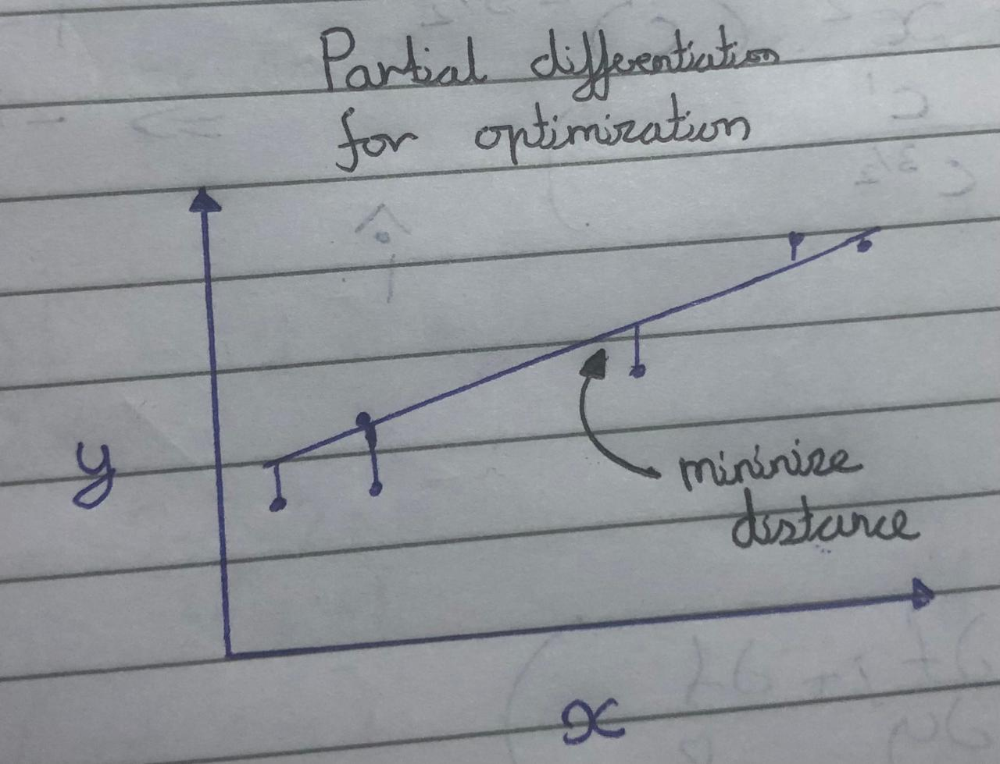

## Differentiation for Vector Calculus

**Course: HKUST Vector calculus for engineers**

**Module: 2**

**Date completed: 20/05/26**

*Caution: These notes are meant to be for revision after learning the subject , not as a method for teaching oneself the subject*

## 

## Introduction

Now we have finished the basics of vectors, vector identities ,analytic geometry and vector & scalar fields; we move on to the differentiation of vectors, this is of extreme importance when dealing with fields, since in a multitude of applications in physics and various other fields we would like to differentiate from vector to scalar or the opposite. 

## Partial Derivatives

#### Definition

A partial derivative is defined as:

$\frac{\partial f}{\partial x}=\lim\limits_{h \to 0}\frac{f(x+h,y)-f(x,y)}{h}$

The definition is basically and extension of the definition of an ordinary derivative. 

#### 

#### How do you partially differentiate?

Well simple, just treat the the other variable as a constant

$f(x,y)=x^3y-8y^2x$

$\frac{\partial f}{\partial x}=3x^2y-8y^2$

###### Mixed partial derivatives in both directions are the same!

i.e $\frac{\partial f}{\partial y \partial x} =\frac{\partial f}{\partial x \partial y}$

$\frac{\partial f}{\partial x} = 3x^{2}y - 8y^{2}$

$\frac{\partial f}{\partial y} = x^{3} - 16yx$

$\frac{\partial^{2} f}{\partial y \partial x} = 3x^{2} - 16y$

$\frac{\partial^{2} f}{\partial x \partial y} = 3x^{2} - 16y$

QED.

#### Partial differentiation in optimization

Lets say we have a dataset with the inputs $x_i$ and the outputs for a particular input $y_i$ now what we want to do is to construct a straight line which fits the data the best, and we want to fit the data using the mse(mean squared error loss function). The parameters we want to optimize for are the slope and the intercept in the equation of a line $\beta_0, \beta_1 $ in the equation $\hat y=\beta_0+\beta_1x_i$

To minimize/maximize **any** function in calculus we first find out where the slope is 0, these points could be minima, maxima or saddle points, then we ascertain the type and whether its local or global. It works the same of pd except whe need to do it 2 or n times - $\frac{\partial \ error}{\partial \beta_0}=0, \frac{\partial \ error}{\partial \beta_1}=0$

We want to minimize 

$error= \sum_{i=1}^n(\hat y - y_i)^2$

$error= \sum_{i=1}^n(\beta_0+\beta_1x_i- y_i)^2$

We get when differentiating by $\beta_0$

$= \sum_{i=1}^n\beta_0+\beta_1x_i- y_i$

$= n\beta_0+\beta_1\sum_{i=1}^n x_i=\sum_{i=1}^n y_i$

We get when differentiating by $\beta_1$

$= \sum_{i=1}^n\beta_0x_i+\beta_1x_i^2- x_iy_i$

$= \beta_0\sum_{i=1}^n x_i+\beta_1\sum_{i=1}^n x_i^2=\sum_{i=1}^n y_ix_i$

###### Example

Q find the optimum parameters for a line with datapoints (2,3),(0,5),(-2,-1) and (-3,0)

| **xi​**               | **yi​**              | **xi2​**                  | **xi​yi​**                 |
| --------------------- | -------------------- | ------------------------- | -------------------------- |
| 2                     | 3                    | 4                         | 6                          |
| 0                     | 5                    | 0                         | 0                          |
| -2                    | -1                   | 4                         | 2                          |
| -3                    | 0                    | 9                         | 0                          |
| **$\sum x_{i} = -3$** | **$\sum y_{i} = 7$** | **$\sum x_{i}^{2} = 17$** | **$\sum x_{i} y_{i} = 8$** |

$4 \beta_{0} - 3 \beta_{1} = 7$

$-3 \beta_{0} + 17 \beta_{1} = 8$

$y_{i} = 0.898 x_{i} + 2.4372$

#### Chain rule

The chain rule allows us to break down a more complicated differentiation into a simpler multi-step differentiation. 

we know 

$f=(x,y)$

$df=f(x+dx,y+dy)-f(x,y)$

$df=[f(x+dx,y+dy)-f(x,y+dy)]+[f(x,y+dy)-f(x,y)$

$df= \frac{\partial f}{\partial x}dx + \frac{\partial f}{\partial x]y} dy$

This identity then allows us to deconstruct any differentiation into a multi stage partial differentiation.

##### Example

$x = t^{2} + 3t,y = 5t$

$f = xy$

we need $\frac{df}{dt}$

$df = \frac{\partial f}{\partial x} dx + \frac{\partial f}{\partial y} dy$

$\frac{df}{dt} = \frac{\partial f}{\partial x} \frac{dx}{dt} + \frac{\partial f}{\partial y} \frac{dy}{dt}$

$\frac{df}{dt} = y \cdot 2t + 3 + x \cdot 5$

$\frac{df}{dt} = 10t^{2} + 15t + 5t^{2} + 15t$

$\frac{df}{dt} = 15t^{2} + 30t$

You can verify by taking directly

#### Triple product rule:

This rule simply states that if we have:

$f(x,y,z)=0$

then 

$\frac{\partial x}{\partial y} \frac{\partial y}{\partial z} \frac{\partial z}{\partial x}=-1$

## Del Operator

The del operator is extremely simple, it is just defined as this: 

$\nabla = \frac{\partial}{\partial x}\hat i+\frac{\partial}{\partial y}\hat j +\frac{\partial}{\partial z}\hat k$

that's all, its just applied in different ways to different fields

#### Gradient

This is the del operator applied to a **scalar field, and it returns a vector value, this value tell you the direction in which the increase of the function is strongest**. *Remember allll the Deep learning stuff about gradients, well this is basically it* 

$\nabla f = \frac{\partial f}{\partial x}\hat i+\frac{\partial f}{\partial y}\hat j +\frac{\partial f}{\partial z}\hat k$

###### Example

$f=x^2yz-3z^3y+y^4$

$\nabla f= (2xyz )\hat i+(x^2z-3z^3+4y^3)\hat j+(x^2y-9z^2y)\hat k$

#### Divergence

This is the **dot product of the del operator with a vector field, it gives a scalar which indicates the amount of outflow/inflow happening at a particular point.**

$u=u_x\hat i +u_y\hat j +u_k\hat k$

$\nabla \cdot u = \frac{\partial u_x}{\partial x}\hat i+\frac{\partial u_y}{\partial y}\hat j +\frac{\partial u_z}{\partial z}\hat k$

###### Example

$u=(xy^2)\hat i +(y^3xz)\hat j +(xy)\hat k$

$\nabla \cdot u=(y^2)\hat i +(3y^2xz)\hat j +(0)\hat k$

#### Curl

Okay here the interpretation is a bit more difficult, **its the cross product of the del operator with a vector field which produces a vector field and basically yeah.......it measures the 'vorticity' of the vector field around the point.**

$u=u_x\hat i +u_y\hat j +u_k\hat k$

$$
\nabla \times \mathbf{u} =
\begin{vmatrix}
\mathbf{i} & \mathbf{j} & \mathbf{k} \\
\partial_x & \partial_y & \partial_z \\
u_x & u_y & u_z
\end{vmatrix}
$$

###### Example

$u=xy\hat i +y\hat j +z\hat k$

$$
\nabla \times \mathbf{u} =
\begin{vmatrix}
\mathbf{i} & \mathbf{j} & \mathbf{k} \\
\partial_x & \partial_y & \partial_z \\
xy & yz & xz
\end{vmatrix}
$$

$\nabla \times u = 0$

#### Laplacian

Its basically the dot product of two del operators, it can be operated on both a scalar and vector field and results in both a scalar and vector field; it represents the **difference between the value of a physical quantity at a specific point and its average value in the immediate surrounding neighbourhood**

$\nabla^2 = \vec{\nabla} \cdot \vec{\nabla} = \frac{\partial^2}{\partial x^2} + \frac{\partial^2}{\partial y^2} + \frac{\partial^2}{\partial z^2}$

**On a Scalar Field ($f$):**

$\nabla^2 f = \frac{\partial^2 f}{\partial x^2} + \frac{\partial^2 f}{\partial y^2} + \frac{\partial^2 f}{\partial z^2}$

**On a Vector Field ($\vec{u}$):**

$\nabla^2 \vec{u} = \nabla^2 u_1 \mathbf{\hat{i}} + \nabla^2 u_2 \mathbf{\hat{j}} + \nabla^2 u_3 \mathbf{\hat{k}}$

###### Example

$\nabla^2 (x^2 + y^2 + z^2)$

$= 2 + 2 + 2$

$= 6$

## Vector differentiation identities

These do not have to be memorized, however they are important identities in terms of vector calculus. **They can all be derived with knowledge of the Kronecker delta, Levi Civita symbols and the respective identities that we find in module 1.**

1. $\nabla \times (\nabla f) =0$

2. $\nabla \cdot (\nabla \times u)=0$

3. $\nabla \times (\nabla \times \vec{u}) = \nabla (\nabla \cdot \vec{u}) - \nabla^2 \vec{u}$

4. $\nabla \cdot (f\vec{u}) = \vec{u} \cdot \nabla f + f\nabla \cdot \vec{u}$

5. $\nabla \times (f\vec{u}) = \nabla f \times \vec{u} + f\nabla \times \vec{u}$

6. $\nabla (\vec{u} \cdot \vec{v}) = (\vec{u} \cdot \nabla) \vec{v} + (\vec{v} \cdot \nabla) \vec{u} + \vec{u} \times (\nabla \times \vec{v}) + \vec{v} \times (\nabla \times \vec{u})$

7. $\nabla \cdot (\vec{u} \times \vec{v}) = \vec{v} \cdot (\nabla \times \vec{u}) - \vec{u} \cdot (\nabla \times \vec{v})$

8. $\nabla \times (\vec{u} \times \vec{v}) = \vec{u} (\nabla \cdot \vec{v}) - \vec{v} (\nabla \cdot \vec{u}) + (\vec{v} \cdot \nabla) \vec{u} - (\vec{u} \cdot \nabla) \vec{v}$

#### Example proofs:

###### Example 1

$\nabla \times (f\vec{u}) = \nabla f \times \vec{u} + f\nabla \times \vec{u}$

$[\nabla \times f \vec{u}]_{\text{i}}$

$\epsilon_{ijk} \frac{\partial}{\partial x_{j}} f \vec{U}_{k}$

$\epsilon_{ijk}\, f \, \frac{\partial U_k}{\partial x_j}
\;+\;
\epsilon_{ijk}\, U_k \, \frac{\partial f}{\partial x_j}$

$\bigl(f \, \nabla \times \mathbf{U}\bigr)_i
\;+\;
\bigl(\nabla f \times \mathbf{U}\bigr)_i$

$f \nabla \times u + \nabla f \times U$

###### Example 2

$\nabla \cdot (\vec{u} \times \vec{v}) = \vec{v} \cdot (\nabla \times \vec{u}) - \vec{u} \cdot (\nabla \times \vec{v})$

$\nabla_{i} \cdot (u \times v)_{i}$

$\nabla_{i} \cdot \epsilon_{ijk} U_{j} V_{k}$

$\epsilon_{ijk} \frac{\partial}{\partial x_{i}} U_{j} V_{k}$

$\epsilon_{ijk} v_{k} \frac{\partial}{\partial x_{i}} u_{j} + \epsilon_{ijk} U_{j} \frac{\partial V_{k}}{\partial x_{i}}$

$V_{k} \epsilon_{ijk} \frac{\partial}{\partial x_{i}} U_{j} - U_{j} \epsilon_{jik} \frac{\partial}{\partial x_{i}} V_{k}$

$V_k (\nabla \times \mathbf{U})_k
\;-\;
U_j (\nabla \times \mathbf{V})_j$

$V (\nabla \times u) - U (\nabla \times v)$
